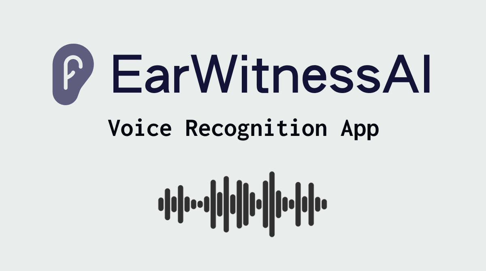

<p align="center">
  
</p>

# EarWitnessAI Voice Recognition App

This application allows you to record audio, transcribe it using a local Whisper model, and automatically paste the transcription into the active window. It's designed to be a quick and efficient tool for voice-to-text input across the whole operating system.

## Features

- Record audio with a simple keyboard shortcut
- Transcribe audio using a local Whisper model
- Automatically copy and paste transcription into the active window
- Automatically clears the clipboard after pasting

## How It Works

1. The app runs in the background, listening for a specific keyboard shortcut (default: Ctrl+Space).
2. When the shortcut is pressed, it starts recording audio from the default microphone.
3. Pressing the shortcut again stops the recording.
4. The recorded audio is saved as a WAV file.
5. The WAV file is transcribed using the local Whisper model.
6. The transcribed text is copied to the clipboard and automatically pasted into the active window.
7. The clipboard is cleared after pasting.

## Local Whisper Model

This version of EarWitnessAI uses OpenAI's Whisper model locally for transcription. By default, it uses the "base" model, but you can change it to other sizes based on your needs and system capabilities.

Available model sizes:

| Model  | Parameters | File Size |
| ------ | ---------- | --------- |
| tiny   | 39 M       | ~150 MB   |
| base   | 74 M       | ~290 MB   |
| small  | 244 M      | ~970 MB   |
| medium | 769 M      | ~3.1 GB   |
| large  | 1550 M     | ~6.2 GB   |

To change the model size, modify the following line in `earwitnessai-local.py`:

```python
model = whisper.load_model("base")
```

Replace "base" with your desired model size (e.g., "tiny", "small", "medium", or "large").

Note: When you first run the application, it will download the selected model, which may take some time depending on your internet connection and the model size. The model will be cached on your system for future use.

## Setup and Customization

1. Clone the repository:

   ```
   git clone https://github.com/janjezek/earwitnessai.git
   cd earwitnessai
   ```

2. Install the required dependencies:

   ```
   pip install -r requirements.txt
   ```

3. Install FFmpeg (required for audio processing):

   On macOS using Homebrew:

   ```
   brew install ffmpeg
   ```

   If you encounter issues with Python dependencies after installing FFmpeg, you can uninstall the Homebrew Python version:

   ```
   brew uninstall --ignore-dependencies python@3.12
   ```

4. Customize the keyboard shortcut:

   - Open `earwitnessai-local.py`
   - Locate the `hotkey` variable (around line 131)
   - Modify the keyboard combination as desired, e.g.:
     ```python
     hotkey = keyboard.HotKey(
         keyboard.HotKey.parse('<ctrl>+<space>'),
         on_activate)
     ```

5. Run the application:
   ```
   python earwitnessai-local.py
   ```

## Requirements

- Python 3.7+
- FFmpeg
- Dependencies listed in `requirements.txt`

## Note

This application requires access to your microphone and simulates keyboard input for pasting. Make sure you trust the source and have reviewed the code before running it on your system.

## License

[MIT License](LICENSE)
